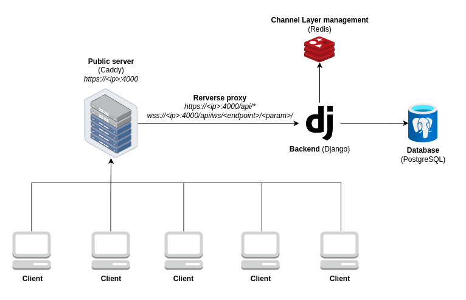

# PONGUE (ft_transcendence)
This project features an online Pong game built with modern web technologies. We used Docker to orchestrate the various containers, Django to power the backend, Caddy as the web server, Postgres as the database, and Redis for efficient channel layer management.

## Project architecture diagram


## System Requirements

To run this project, you will need the following software installed on your machine:

- **Docker**: Version 27.2.0 or higher
- **Make**: GNU Make 4.3

## Installation

1. **Clone the repository:**

   ```bash
   git clone https://github.com/fmanzanare/ft_trascendence.git
   ```

2. **Navigate to the project directory:**

   ```bash
   cd ft_trascendence
   ```

3. **Run the Project:**

   ```bash
   make
   ```

## Usage

Once the project is running, access the game by navigating to https://localhost:4000 in your web browser.
   
## Completed modules.

This project is part of curriculum 42 and consists of several modules designed to cover different aspects of software development. For this project, we have chosen the following modules:

- **42 API Connection:** Integration with the 42 API.
- **Microservices:** Microservices-based architecture for greater scalability.
- **JWT + 2FA:** Implementation of JWT authentication with two-factor authentication.
- **Backend Framework (Django):** Robust backend using Django.
- **Bootstrap + DB (PostgreSQL):** Initial database setup and data loading.
- **Graphics / 3D:** Graphics and 3D rendering.
- **Remote:** Remote functionalities for the game.
- **User Statistics:** User statistics module.
- **Server-side PONG:** Server-side implementation of the PONG game.
- **User Management:** User management, including adding friends from the chat.
- **Live Chat:** Live chat functionality.

## Stopping the Server and Cleaning Up

To stop the server and clean up the Docker, follow these steps:

1. **Stop the Server:**
   Press `Ctrl + C` in the terminal where the server is running to stop it.

2. **Remove Docker Volumes:**
   Run the following command to remove Docker volumes:

     ```bash
     make clean_volumes
     ```

3. **Remove All Containers and Networks:**
   Run the following command to remove all containers, networks, and images:

     ```bash
     make clean_all
     ```

This ensures that all resources associated with the project are cleaned up properly.

## Tareas Pendientes

### FRONTEND
- [X] Eliminar encodeURI de los formularios del front {Antonio}
- [X] Tamaño del juego local cuando se hace resize de la pantalla {Fernando}
- [X] Menú responsive con botón desplegable Bootstrap (Opcional) {Antonio}
- [X] Modificar el placeholder del cambio de "Username" del perfil {Antonio}
- [X] Gestionar el registro por API 42 cuando ya existe un usuario con ese nombre (agregar #42 al final del username) {Antonio}
- [X] Agregar espacio entre "Do you have an account? Sing up" y API 42 {Antonio}
- [X] Página de callback con API de 42 {Antonio}
- [X] Hover effects sobre los botones principales de la interfaz {Antonio}
- [X] Cross button en modales - ELIMINADO {Antonio}
- [NO] Gráficos circulares para mostrar las estadísticas del usuario (Opcional) {Antonio}
- [ ] Refactor del Chat {Victor + Fernando}
- [X] Actualizar el estado del front a "In Game" cuando está en partida Online. Verificar en Tournament {Antonio}
### BACKEND
- [X] Eliminar prints de Django {Fernando}
- [X] Redirección http a https en caddy {Antonio}
- [X] Limitar que un mismo usuario haga login dos veces {Fernando}
- [X] Velocidad del juego remoto {Fernando}
- [X] Añadir validación en Backend de la longitud del nombre de usuario (permitir un máximo de 3 caracteres más que en el front para la API de 42) {Fernando}
- [X] Cambiar los nombres a las migraciones que genera Django. Evitar que salgan dos con "init" {Fernando}
### DOCKER
- [X] Cambiar "docker-compose" por "docker compose" {Fernando}
- [X] En Makefile cambiar "docker compose logs -f" por "docker compose logs -f --tail=1000" {Fernando}
- [X] En Makefile, la regla "clean" debería usar "docer system prune" {Fernando}
- [X] Eliminar la versión de docker-compose.yml {Fernando}
- [X] Corregir las dependencias, de forma que backend dependa de todas, y las demás sin dependencias {Fernando}
- [X] No exponer puertos de ningún servicio, salvo el de Caddy. La conexión entre contenedores debe hacerse desde la network de docker {Fernando}
- [X] Poner versión mínima de la imagen "postgresql" y usar binami/postgre como imagen {Fernando}
- [X] Añadir un fichero .env.example sólo con keys, pero sin values {Fernando}
- [X] Poner versión mínima de la imagen de "caddy" {Fernando}
- [X] Corregir volúmenes. Eliminar los driver y binds {Fernando}
- [X] Crear usuario en Dockerfile para no hacerlo con root y evitar el escalado de privilegios {Fernando}
- [NO] Eliminar la instalación de netcat en el Dockerfile de Django {Fernando} - Usamos Netcat para comprobar la conexión del backend con postgres
- [ ] Corregir conexión desde Caddy con dominio. Crear certificados ssl, enlazados al dominio (Opcional) {Fernando}
### EXTRAS / MEJORAS:
- [ ] Documentar en README.md {Fernando + Victor}
- [ ] Módulo de IA {Fernando}
### PRUEBAS / TESTEO:
- [ ] PNG bomba
- [X] Envío de una petición enorme desde CURL - biblia (curl --cacert ./caddy/data/caddy/pki/authorities/local/intermediate.crt -X POST -d @bible.txt https://localhost:4000/api/login/)
- [ ] Testeo con compañeros (Jarre, Sergio, Ruzafa, Pablo, etc.)