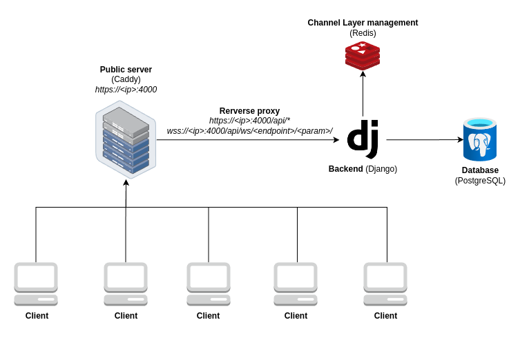
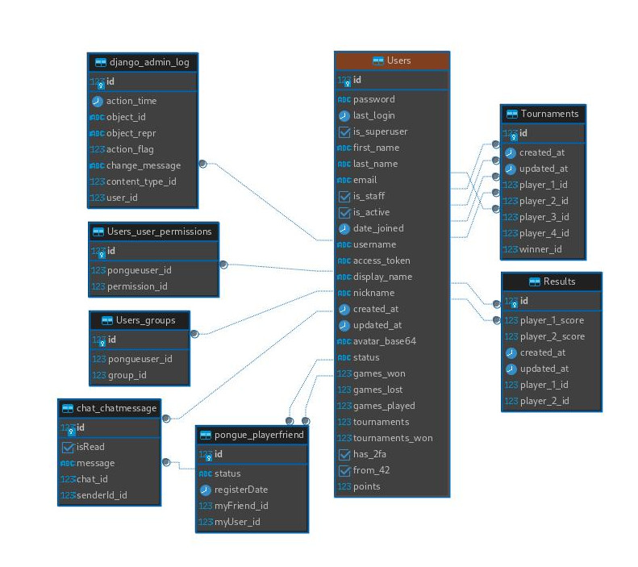

# ft_transcendence — real-time online Pong platform

`ft_transcendence` is the final project of the **42** core curriculum. In this implementation, it became a full web platform around Pong: a **vanilla JavaScript single-page frontend**, a **Django backend**, **WebSocket-driven real-time gameplay**, and a Dockerized local environment with **Caddy**, **PostgreSQL**, and **Redis**.

From an engineering perspective, this repository demonstrates a strong foundation in **real-time application design**, **backend architecture**, **WebSocket communication**, **containerized environments**, and end-to-end product thinking — not just a simple game prototype.

## What the project includes

- **Online Pong matches** with server-driven game state updates over WebSockets
- **Local 1 vs 1 mode** from the web UI
- **4-player tournaments** with dedicated matchmaking and tournament flows
- **JWT-based authentication** with optional **TOTP 2FA**
- **42 OAuth login** integration
- **User profiles**, avatars, status tracking, and editable user data
- **Ranking and match history** views
- **Friend management and live chat**
- A dedicated **Three.js-based 3D game module** for the Pong experience

## Architecture at a glance



### Runtime shape

- **Caddy** serves the SPA frontend and routes `/api/*` traffic to Django (`caddy/Caddyfile`)
- **Django 4.2** exposes API endpoints for auth, profiles, ranking, friends, and history (`django/pongue/urls.py`, `django/ft_backend/urls.py`)
- **Django Channels** handles real-time communication for gameplay, tournaments, status, chat, and friendship events (`django/ft_backend/asgi.py`, `django/chat/routing.py`, `django/remote/routing.py`)
- **Redis** is used as the channel layer backend for WebSocket coordination (`django/ft_backend/settings.py`)
- **PostgreSQL** persists users, results, tournaments, friendships, and chat-related data (`docker-compose.yml`, `django/pongue/models.py`, `django/chat/models.py`)
- **Docker Compose** ties the local environment together (`docker-compose.yml`)

## Product capabilities

### Authentication and account flows

- Username/password login and registration (`django/pongue/urls.py`)
- **42 intra OAuth** login flow (`django/pongue/views.py`)
- **JWT issuance and validation** for authenticated API access (`django/pongue/views.py`, `django/pongue/jwt.py`)
- Optional **two-factor authentication** based on TOTP (`django/pongue/urls.py`, `django/pongue/otp.py`)

### Gameplay and tournaments

- Real-time 1 vs 1 matches through WebSockets (`django/remote/game_consumer.py`)
- Backend-side game loop, score progression, countdown, and winner resolution (`django/remote/new_game.py`)
- Tournament socket flow for 4-player brackets (`django/remote/tournament_consumer.py`, `django/remote/views.py`)
- Frontend routes for home play and tournaments (`game_3d/dev/frontend/views/Home.js`, `game_3d/dev/frontend/views/Tournaments.js`)

### Social and profile layer

- Friend requests and friendship states (`django/pongue/models.py`)
- Live chat and chat history (`django/chat/models.py`, `django/chat/consumers.py`)
- User presence / status flows over WebSockets (`django/remote/status_consumer.py`)
- Profile, ranking, history, and statistics pages (`game_3d/dev/frontend/views/Profile.js`, `game_3d/dev/frontend/views/Ranking.js`)

## Tech stack

| Layer                          | Technology                                                    |
| ------------------------------ | ------------------------------------------------------------- |
| Frontend                       | Vanilla JavaScript SPA, HTML, CSS, Bootstrap-style UI classes |
| Game client                    | Three.js-based 3D game module                                 |
| Backend                        | Django 4.2                                                    |
| Realtime                       | Django Channels + WebSockets                                  |
| Persistence                    | PostgreSQL                                                    |
| Messaging / channel layer      | Redis                                                         |
| Reverse proxy / static serving | Caddy                                                         |
| Local orchestration            | Docker Compose                                                |

## Why this project matters technically

This repository goes beyond “a Pong clone”. It demonstrates several concerns that remain relevant in professional systems work:

- **Real-time coordination** between browser clients and backend processes
- **Server-managed multiplayer state** rather than a purely client-side game
- **Containerized local environments** with reverse proxy, application, database, and Redis
- **Authentication and identity flows** including OAuth, JWT, and 2FA
- **Stateful product features** such as rankings, history, tournaments, and friendship relationships
- **Frontend routing and application state** in a custom vanilla JS SPA

## Project structure

```text
.
├── caddy/                 # Reverse proxy and static serving config
├── django/                # Django backend, Channels, models, auth, realtime consumers
├── game_3d/               # Frontend app + 3D Pong client
├── docker-compose.yml     # Local environment orchestration
├── Makefile               # Developer commands
└── .env.example           # Required environment variables
```

## Database model



## Run locally

### Requirements

- Docker
- Docker Compose
- GNU Make

### Setup

1. Clone the repository:

   ```bash
   git clone https://github.com/fmanzanare/ft_trascendence.git
   cd ft_trascendence
   ```

2. Create your environment file:

   ```bash
   cp .env.example .env
   ```

3. Fill the required variables in `.env`.
4. Start the platform:

   ```bash
   make
   ```

The app will be available at:

- `https://localhost:4000`

This local HTTPS setup is served by Caddy (`caddy/Caddyfile`) and forwards API traffic to Django.

### Useful commands

```bash
make              # build and start containers
make down         # stop containers
make logs         # inspect logs
make migrate      # run Django migrations inside the backend container
make p_shell      # open Django shell_plus
make clean_all    # remove containers and images
make clean_volumes
```

## Notes about local bootstrap

The backend container entrypoint automatically:

- waits for PostgreSQL when configured,
- runs `makemigrations`,
- runs `migrate`,
- and creates a superuser from environment variables.

See `django/entrypoint.sh` and `.env.example`.

## Scope note

This README intentionally focuses on the **actual architecture and product behavior present in the repository**. It avoids overstating the project as a production cloud platform; the value here is the combination of **real-time application design**, **backend logic**, **social features**, and **containerized system composition** in a substantial full-stack project.
